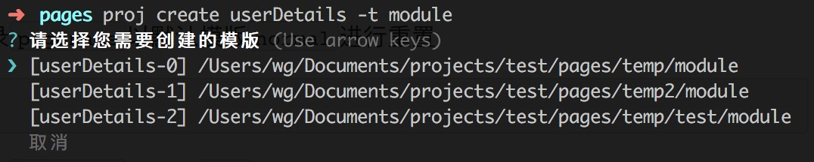

## 背景由来

以小程序目录结构为例:
- 所有的页面都位于`pages`目录下
- 所有页面都是一个个独立的文件夹, 在文件夹内包含固定的4个文件, 然后每个文件也许都有些默认的代码、内容
- 创建好文件后还需要去`app.json`目录添加路由


又或者以一个项目为例:
- 每次的需求开发都要求新建一个项目
- 这个项目有很多的开发目录及默认的文件 (例: pages, server, tools, gulpfile.js, .gitignore)
- 在创建的过程中也许其中个别项目有 **90%** 一致, 仅剩下 **10%** 不一样


## 安装

```bash
$ sudo npm i project-pages-manage -gd
```

> 安装好后会生成主命令`proj`

## 使用

1. 模版管理

> 模版主命令为: proj template 或 proj t

`add` 添加模版目录 (将指定模版目录添加至自定义模版路径中 **读取模版时将以当前命令执行目录为准查找**)

```bash
$ proj t add modulename
$ proj t add modulefolder/modulename
```


`add` 添加全局自定义模版 (以当前目录为准将指定目录作为模版添加至全局自定义模版)

```bash
$ proj t add modulename -g
$ proj t add modulefolder/modulename -g
```


`rm` 删除模版配制 (仅删除自定义模版配制路径)

```bash
$ proj t rm modulename
$ proj t rm modulefolder/modulename
```

`rm` 删除模版配制及本地对应的模版文件

```bash
$ proj t rm modulename -d
$ proj t rm modulefolder/modulename -d
```

`rm` 删除全局中的自定义模版

```bash
$ proj t rm modulename -g
$ proj t rm modulefolder/modulename -g
```

`ls` 显示所有的模版配制路径

```bash
$ proj t ls
```


2. 模版文件规则

```
customModule
    ├─ pages
    |   ├─ somefiles
    |   ├─ somefiles
    |   ├─ ...
    ├─ config.yml
    ├─ script.js
```

- `customModule` 
    - 模版名称

- `pages` (**必需**) 
    - 目录名称固定
    - 里面存放的是创建模版时需要复制的所有文件

- `config.yml` (**可选**) 当前模版的一些配制信息
    - 内置配制 `rename: true` 
        - 表示以当前模版创建页面后是否将页面内的所有文件名全改成与页面名称一致 (主要针对小程序的目录结构)

- `script.js` (**可选**) 在创建模版时的事件监听
    - 目前仅支持两个监听 `onBefore` & `onAfter`
    - 两监听返回的参数一致
        - cmd: 当前命令名称
        - option.modulePath: 当前模版的完整路径
        - option.targetPath: 根据模版创建页面时的目标位置完整路径
        - option.config: 当前模版的配置信息
    - 在 `onBefore` 中只有 `return false;` 会中止页面的操作行为
    - 在 `onBefore` 中如果存在异步行为请使用 `await` 操作, 否则页面的创建不会等待异步的操作结果

示例: 
```js
exports.onBefore = async (cmd, { modulePath, targetPath, config }) => {}

// 返回false会中止命令的执行
exports.onBefore = async (cmd, { modulePath, targetPath, config }) => false

exports.onAfter  = async (cmd, { modulePath, targetPath, config }) => {}
```


3. 创建页面或目录

> 基本命令: proj create 或 proj c

```bash
$ proj c pagename
```
在当前路径下创建`pagename`目录, 并使用默认模版 `xcx`

```bash
$ proj c pagename -t normal
```
在当前路径下创建`pagename`目录, 并使用模版 `module`

**当在不同的模版路径下出现同名的模版时, 会提示选择, 并列出模版完整路径**




4. 删除页面或目录

> 基本命令: proj delete 或 proj d

```bash
$ proj d pagename
```


5. 重置页面或目录

> 基本命令: proj reset 或 proj r

```bash
$ proj r pagename
```
在当前路径下将已经存在的页面或目录`pagename`以默认模版`xcx`进行重置

```bash
$ proj r pagename -t module
```
在当前路径下将已经存在的页面或目录`pagename`以模版`module`进行重置

**当在不同的模版路径下出现同名的模版时, 会提示选择, 并列出模版完整路径**


6. 修改默认配制项

> 基本命令: proj set config key=value

目前`config`仅有一个配制项允许修改`module=xcx`
    - module: 在创建页面时的默认模版


## 更新历史

v1.1.0

- `Improve` 在复制全局模版时添加 `excludes`, 比如 `node_modules` `.DS_Store` 文件无论如何都是不需要复制的 
- `Improve` 添加模版时记录执行命令时的完整路径. 创建页面查找模版时增加一种查找方式
    - 指定目录 A 为本地模版目录, 且里面有模版 `A/temp1` `A/temp2` ...
    - 在目录 B 中创建页面并指定应用模版为 `temp1`
        - 现有机制会从 **全局默认模版目录** 及 **全局自定义模版目录** **本地B目录** 中去查找模版 `temp1`
        - 对于实际操作而言这明显不符合需求
        - 因此记录了 A 目录, 在查找模版时也会从 A 目录中去查找

v1.0.4 

- `fix` markdown 部分文字错误 
